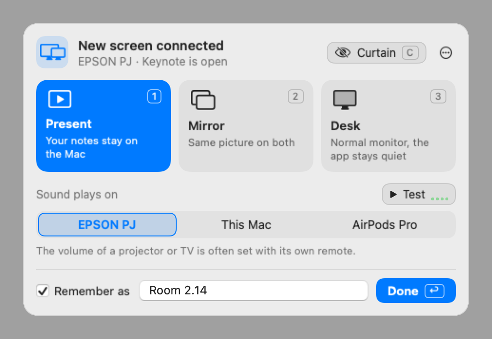

# Present Perfect

Connect your Mac to a projector, TV or meeting room screen and be ready in two key presses.
No searching through System Settings for mirroring, and no hunting for the sound icon in the menu bar.

When you plug in a screen your Mac doesn't know yet, a panel appears in the middle of your screen:

- **Present** (1): the projector shows your slides, your Mac keeps the presenter notes.
- **Mirror** (2): the same picture on both screens.
- **Desk** (3): a normal monitor. Present Perfect stays out of the way and leaves everything to macOS.

In the same panel you choose where the sound plays: the projector or TV, your Mac, or your headphones.
A **Test** button plays a short sound, so you know it works before the room hears your video.

Press **Return** and the choice is remembered for that screen. The next time you connect it,
Present Perfect does the same thing by itself and shows a short note with what it did.
At your own desk it stays completely quiet.

## Installation

1. Download `Present-Perfect-macOS.zip` from the [latest release](../../releases/latest).
2. Double-click the zip to unpack it.
3. Drag **Present Perfect** to your **Applications** folder and open it.

The app is signed and notarized by Apple. The first time, macOS asks whether you want to open an
app downloaded from the internet: click **Open**.

Requires macOS 14 (Sonoma) or later, on Apple silicon or Intel.

## How to use it

| What you want                          | What to do                                                        |
|----------------------------------------|-------------------------------------------------------------------|
| Choose how to use a new screen         | Plug it in. The panel opens. Press **1**, **2** or **3**.         |
| Choose where the sound plays           | Click a sound output in the panel. **T** plays a test sound.      |
| Remember the choice for this screen    | Leave **Remember as** on, give it a name and press **Return**.    |
| Open the panel at any moment           | Press **Control-Option-P** (⌃⌥P), or click the menu bar icon.     |
| Black out the projector for a moment   | In Present, press **C** in the panel (or click **Curtain**).      |
| See which screen the audience sees     | While the panel is open in Present, the other screen says so.     |
| Change or forget a remembered screen   | Open the panel while it's connected. Use **⋯ > Forget This Screen** to start over. |

When you unplug, the sound moves off the screen's speakers and a short note tells you where it plays now.
While a projector or TV is connected for presenting, your Mac doesn't fall asleep.

## Good to know

- **No permissions needed.** Present Perfect uses standard macOS features to arrange screens and
  choose the sound output. It needs no access to your files, camera, microphone or screen.
- **Nothing leaves your Mac.** The app doesn't connect to the internet.
- **Welcome.** The first time you open it, a short welcome explains the basics and asks whether
  Present Perfect may open at login (recommended, so it's ready when you plug in). You can change this
  later in the **⋯** menu or the menu bar icon's menu, where **How It Works…** shows the welcome again.
- **Volume.** Many projectors and TVs don't let your Mac change their volume. Use the screen's own remote.
- **ClickShare.** If the ClickShare app adds a sound output to your Mac, it appears in the panel's sound choices.
- **Teams and Zoom.** These apps have their own setting to share your computer's sound when you share
  your screen ("Include sound" in Teams, "Share sound" in Zoom). Turn it on there when you play a video.
- **Languages.** English, Dutch and French, following your Mac's language.

## Something not working?

Open the menu bar icon's menu (or **⋯** in the panel) and choose **Copy Diagnostics**. This copies a
short report of the screens and sound devices your Mac sees. Paste it in an issue on this page.

## Uninstall

Quit Present Perfect from its menu, then drag it from Applications to the Trash.
If it still shows up in **System Settings > General > Login Items**, remove it there.

## Building from source

Requires Xcode command line tools. Run `./build_app.sh`; the app appears in `dist/`.

## Support

Present Perfect is free. If it saves you time, you can [buy me a coffee](https://buymeacoffee.com/filiphaegdorens).

## License

[MIT](LICENSE) © Filip Haegdorens
